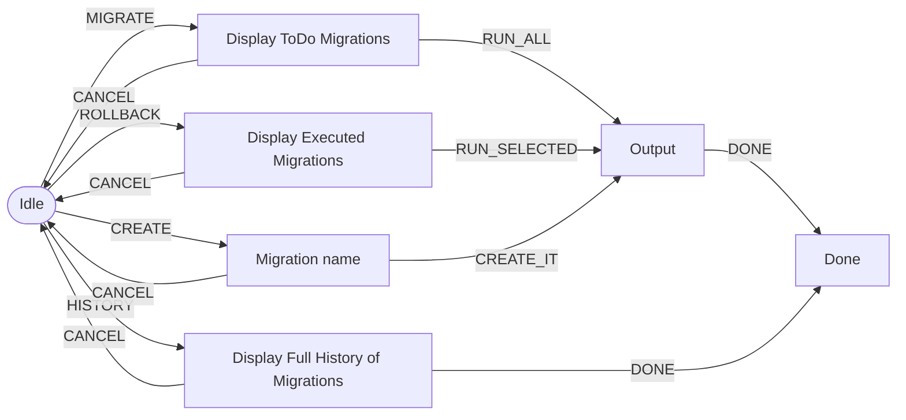

# MigrationTool UI

## Intro

This UI is **optional** and will help you to handle all your
migrations needs.

## States



# Dev

To connect to the backend, you could use the `.env` with something like that: 
```dotenv
BACKEND_PORT=8888
```

# Prod

Add the following parameter:
```bash
<executable file> --backend-port=8888
```